```mermaid
---
config:
  theme: dark
---
sequenceDiagram
        participant Player
        participant AK
        participant Screen
        participant Mainsub
        participant Bomb
        participant Spike
        participant Coin
        participant Gift
        participant Boom
        participant Border
        rect rgb(30, 45, 30)
            note over Player: SCREEN_ENTRY 
            AK->>Screen: SCREEN_ENTRY
            activate Screen
            Screen->> Mainsub: ITD_GAME_MAINSUB_SETUP
            Screen->> Bomb: ITD_GAME_BOMB_SETUP
            Screen->> Spike: ITD_GAME_SPIKE_SETUP
            Screen->>Coin: ITD_GAME_COIN_SETUP
            Screen->>Gift: ITD_GAME_GIFT_SETUP
            Screen->>Boom: ITD_GAME_BOOM_SETUP
            Screen->>Border: ITD_GAME_BORDER_SETUP
            Screen->>Screen: STATE(GAME_PLAY)
            Screen->>Screen: STATE(MAINSUB_DIR_NONE)
            Screen->>Screen: Remove timer - Show idle
            Screen->>Screen: Setup timer - Time tick
            deactivate Screen
        end
        rect rgb(40, 35, 40)
            note over Player: GAME_PLAY
            AK->>Screen: ITD_GAME_TIME_TICK
            alt mainsub_dir == MAINSUB_UP:
                Screen->>Mainsub: ITD_GAME_MAINSUB_GO_UP 
            else mainsub_dir == MAINSUB_DOWN:
                Screen->>Mainsub: ITD_GAME_MAINSUB_GO_DOWN
            end
            Screen->>Mainsub: ITD_GAME_MAINSUB_UPDATE 
            Screen->>Bomb: ITD_GAME_BOMB_SPAWN
	    Screen->>Bomb: ITD_GAME_BOMB_UPDATE
            Screen->>Spike: ITD_GAME_SPIKE_SPAWN
            Screen->>Coin: ITD_GAME_COIN_SPAWN
            Screen->>Gift: ITD_GAME_GIFT_SPAWN
            Screen->>Boom: ITD_GAME_BOOM_UPDATE
            Screen->>Border: ITD_GAME_BORDER_UPDATE
            Screen->>Border: ITD_GAME_BORDER_CHECK_GAME_OVER
            Player->>Screen: Button[UP] - AC_DISPLAY_BUTTON_UP_PRESSED
            Screen->>Screen: STATE(MAINSUB_UP)
            Player->>Screen: Button[DOWN] - AC_DISPLAY_BUTTON_DOWN_PRESSED
            Screen->>Screen: STATE(MAINSUB_DOWN)
            alt Button[UP] release:
                Player->>Screen: AC_DISPLAY_BUTTON_DOWN_RELEASE
                Screen->>Screen: STATE(MAINSUB_NONE)
            else Button[DOWN] release:
                Player->>Screen: AC_DISPLAY_BUTTON_UP_RELEASE
                Screen->>Screen: STATE(MAINSUB_NONE)
            end
        end
        rect rgb(50, 45, 30)
            note over Player: GAME_RESET
            Border->>Screen: ITD_GAME_RESET 
            Screen->>Screen: Remove time tick
            Screen->>Mainsub: ITD_GAME_MAINSUB_RESET
            Screen->>Bomb: ITD_GAME_BOMB_RESET
            Screen->>Spike:ITD_GAME_SPIKE_RESET
            Screen->>Coin: ITD_GAME_COIN_RESET
            Screen->>Gift: ITD_GAME_GIFT_RESET
            Screen->>Boom: ITD_GAME_BOOM_RESET
            Screen->>Border: ITD_GAME_BORDER_RESET
            Screen->>Screen: Save and reset Score
            Screen->>Screen: STATE(GAME_OVER)
            Screen->>Screen: Remove and setup Timer
        end
        rect rgb(30, 40, 60)
            note over Player: GAME_EXIT
            AK->>Screen: ITD_GAME_EXIT_GAME
            Screen->>Screen: STATE(GAME_EXIT)
            Screen->>Screen: Change screen - SCREEN_TRAN(itd_game_over_handle, &itd_game_over)
        end

```

# In the depth game - Game built on AK Embedded Base Kit

## Gameplay Demo:

## Documentation:
| File | Description |
|---|---|   
| [README.md](README.md) | Main project overview, hardware information, gameplay rules, and object descriptions. |
| [docs/01-guide-getting-started.md](docs/01-guide-getting-started.md) | Game programming getting started guide. |
| [docs/02-design-sequence-object.md](docs/02-design-sequence-object.md) | Runtime sequence diagrams for gameplay objects: Mainsub, Bomb, Spike, Coin, Gift, Boom, and Border. |
| [docs/03-design-sequence-runtime.md](docs/03-design-sequence-runtime.md) | Runtime signal-processing flow for button input, AK task messages, timers, game-loop ticks, object updates, and Mermaid sequence diagrams. |
## Introduction:
In the depth is a runner game built on top of the AK Embedded Base Kit — a hands-on platform for embedded programming enthusiasts to explore event-driven design in depth. While building and playing In the depth, you put the following core concepts of modern embedded engineering into practice:
  - System design: Modelling complex logic flows with UML.
  - Process management: Coordinating cooperative Tasks and scheduling them efficiently.
  - Communication: Using Signals, Timers, and Messages to react in real time.
  - Control logic: Building robust state machines for the player, bombs and the overall match progression
### I. Hardware:

<table align="center">
  <tr>
    <td align="center"></td>
  </tr>
</table>
<p align="center"><strong><em>Figure 1:</em></strong> AK Embedded Base Kit - STM32L151</p>

[AK Embedded Base Kit](https://epcb.vn/products/ak-embedded-base-kit-lap-trinh-nhung-vi-dieu-khien-mcu) is an evaluation kit aimed at intermediate and advanced embedded software learners.

The kit integrates a **1.54" OLED LCD**, **3 push buttons**, and **a buzzer** capable of playing short melodies, giving you everything you need to study **event-driven systems** through hands-on game-machine design.
It also exposes **RS485**, the **Qwiic Connect System**, and **Grove** connectors, so it doubles as a convenient prototyping board for real-world embedded projects.

**MCU Overview:**

```text
SoC Name : STM32L151CBT6
RAM      : 16 KB

Flash Partitions Layout
----------------------
[ 0x08000000 - 0x08001FFF ] : Bootloader Partition (8 KB)
=> AK Bootloader

[ 0x08002000 - 0x08002FFF ] : BSF Shared Partition (4 KB)
=> Used for data sharing between Bootloader and Application

[ 0x08003000 - 0x0801FFFF ] : Application Partition (116 KB)
=> Zomwar firmware
```

**MCU Naming Convention:**

| Part | Meaning |
|---|---|
| `STM32` | STMicroelectronics 32-bit MCU family. |
| `L` | Low-power series. |
| `151` | STM32L151 product line. |
| `C` | 48-pin package. |
| `B` | 128 KB Flash memory. |
| `T` | LQFP package. |
| `6` | Industrial temperature grade. |


<table align="center">
  <tr>
    <td align="center"></td>
  </tr>
</table>
<p align="center"><strong><em>Figure 2:</em></strong> Board view Top + Bottom </p>

### II. Game Description and Objects:
The following section will describe the gameplay and core mechanics of **"In the depth"**. It serves as a reference for ongoing game design and firmware development. 

The game opens on the **Welcome screen**, which has a title for the game and many other objects to make the environment more lively. 

<table align="center">
  <tr>
    <td align="center"></td>
  </tr>
</table>
<p align="center"><strong><em>Figure 3:</em></strong> Welcome Screen </p>

After players press any button, they will transfer to the **Main menu**, which offers the following options: 
- **Dive**: start a new match
- **Setting**: Configure gameplay parameters such as sound, speed
- **Rank**: Show the highest score that players can achieve
- **Exit**: Leave the menu and return to the **Welcome Screen**

<table align="center">
  <tr>
    <td align="center"></td>
  </tr>
</table>
<p align="center"><strong><em>Figure 4:</em></strong> Game main menu </p>

<table align="center">
  <tr>
    <td align="center"></td>
  </tr>
</table>
<p align="center"><strong><em>Figure 5:</em></strong> Game play </p>


**Objects in the Game:**

|**Bit map**| **Object Name** | **Description** |
|---|---|---|
| | **Mainsub** | The main object of the game, positioned on the left side of the screen. Moves vertically from the screen border to the map's ground.|
| | **Bomb**    | The most dangerous object in the game. Spawns randomly from the right edge of the screen. Moves extremely fast and can damage the mainsub. Their damage and speed can be configured in the game setting.|
| | **Spike tall** | Another object which can damage the mainsub, spawns from the right edge of the screen but below. Can be extremely dangerous due to its height.|
| | **Spike short** | Like **Spike tall** but shorter. Players must be cautious when low diving.|
| | **Coin**    | The coin's mechanic is like the bomb; these objects spawn randomly from the right edge of the screen and move kinda slow. Each coin contains 10 points. |
| | **Gift**    | The most mysterious object in the game. Spawns randomly from the right edge of the screen with a small amount. This object contains 4 random rewards that can make the game easier.|
| | **Boom**    | A small animation, happens when there is a collision between the mainsub and bombs or spikes. Has no game effect itself.|


### III. How to Play:
- You control the **Mainsub**. Use the **[Up]** and **[Down]** buttons to move. Holding either button moves the Mainsub faster.
- Bombs, spikes and other objects will appear from the right edge of the map.
- Your mission is to dodge bombs, spikes and collect as many coins as you can. The more coins you have, the higher score you get.  
#### Game Mechanics:
- **Scoring:** Each coin you collect will count as 10 points. The total score will be shown on the border.
- **Bombs and Spikes:** These can damage your mainsub so make sure to dodge them. Each bomb or spike you hit will make your heart go down by 1. These objects' damage can be configured in the game setting. 
- **Special object:** There is an object called **"Gift"**, which gives you a random reward, from a bonus heart to a nuke that destroys all surrounding objects. 
- **Animation:** To keep the game more lively, there are some extra animations for the bomb, sea grass, and a boom animation when the mainsub gets hit. 
- **Game over:** When the mainsub's hearts drop to zero, the match ends, all the objects are reset and the score is saved. A short mainsub sinking screen will appear and then the **Game over** menu appears, which offers 3 options:
  - **Retry:** play again
  - **Rank**: view leaderboard
  - **Home**: Return to main menu

<table align="center">
  <tr>
    <td align="center"></td>
  </tr>
</table>
<p align="center"><strong><em>Figure 6:</em></strong> Mainsub sinking </p>

<table align="center">
  <tr>
    <td align="center"></td>
  </tr>
</table>
<p align="center"><strong><em>Figure 7:</em></strong> Game over </p>


### IV. Basic Game Sequence Logic

<!-- <table align="center">
  <tr>
    <td align="center"></td>
  </tr>
</table> -->


<p align="center"><strong><em>Figure 8:</em></strong> Basic game sequences </p>

<h3>Contact Me</h3>
<p>
  <a href="https://github.com/KimThanhNguyen1409">
    
  </a>
  
  <a href="https://www.linkedin.com/in/nguyenkimthanh1409/">
    
  </a>
  
  <a href="mailto:nkimthanh47@gmail.com">
    
  </a>
</p>
