<h1 align="center">Game programming getting started guide</h1>

Welcome to the game programming project on the STM32L151 microcontroller! This repository provides a foundational source code base along with detailed documentation to help you quickly get familiar with the system architecture and start building your own game.

---

## Table of Contents

- [I. Create Your Own "Playground" (Fork)](#i-create-your-own-playground-fork)
- [II. Quick Start Guide (Environment Setup)](#ii-quick-start-guide-environment-setup)
- [III. Game Programming Workflow](#iii-game-programming-workflow)
  - [Basic Workflow](#basic-workflow)
  - [Modify the Game](#modify-the-game)
  - [Example: Displaying the welcome screen ](#displaying-the-welcome-screen)

---

## I. Create Your Own "Playground" (Fork) 

To initialize your personal project, follow these steps:

### 1. Access the original repository

**Link:** [https://github.com/the-ak-foundation/ak-base-kit-stm32l151](https://github.com/the-ak-foundation/ak-base-kit-stm32l151)

### 2. Fork the repository

Click the **Fork** button in the top-right corner to create a copy of the project under your personal account.
You can also click the **Star** button next to **Fork** to support the author.

<p align="center">
  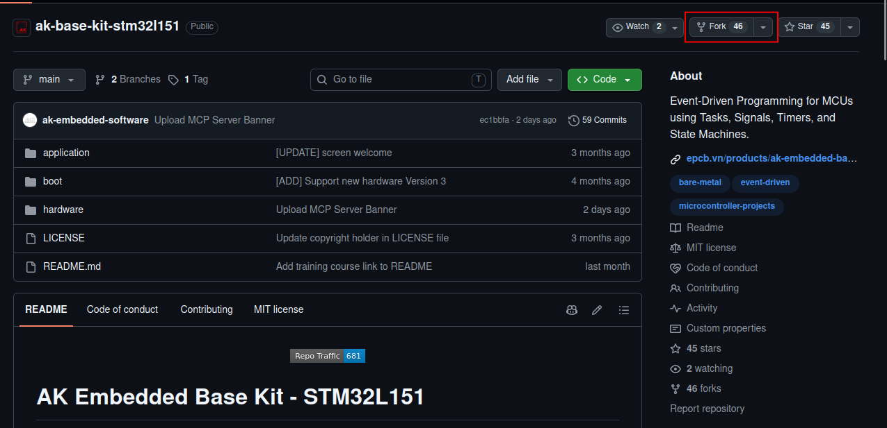
</p>

### 3. Create the fork

<p align="center">
  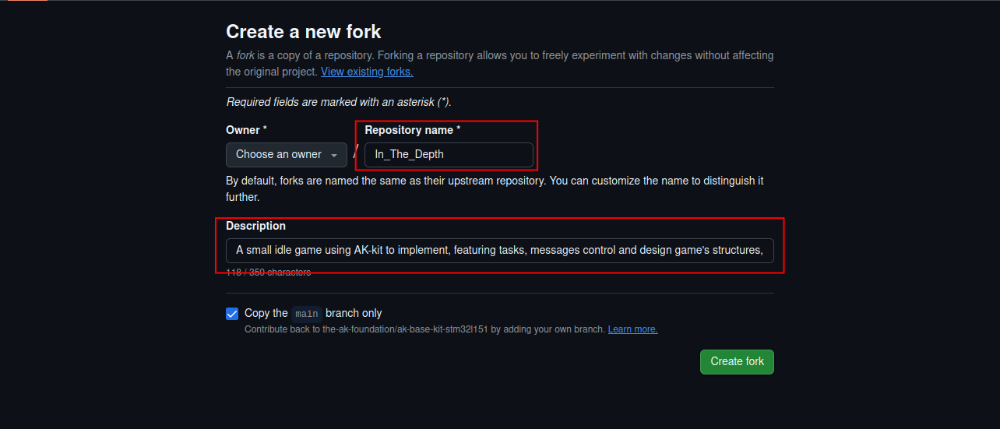
</p>

> **Note:**
> - Name the repository after **your game's name**.
> - Add a brief description of your game in the **Description** field.

Once the fork is created, GitHub redirects you to the new repository — this is the "skeleton" you will use to develop and complete your game:

<p align="center">
  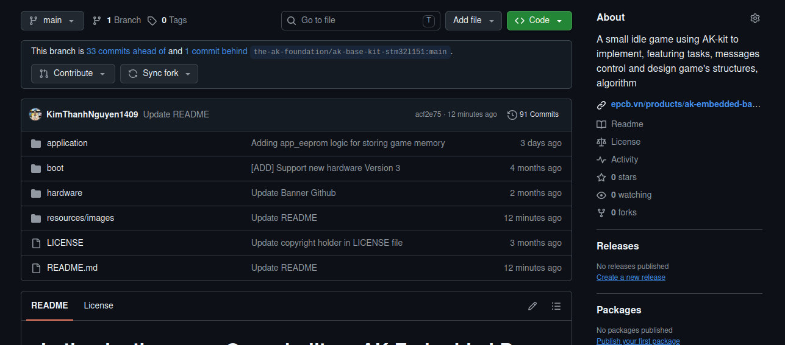
</p>

---
**Remember to clone this repo to your local machine and start coding**

## II. Quick Start Guide (Environment Setup)

To build the source code and flash firmware onto the kit, you need to set up the development environment on Ubuntu/Linux. Step-by-step instructions are available here:

**[AK Embedded Base Kit STM32L151 — Getting Started](https://epcb.vn/blogs/ak-embedded-software/ak-embedded-base-kit-stm32l151-getting-started)**

---

## III. Game Programming Workflow

> **Note:** Since this is an embedded software project, you should use the **Terminal on an Ubuntu/Linux environment** to ensure the build and flashing process runs correctly.

> **Note:** This workflow is base on my experience while making this game so you don't need to follow directly this instruction. If you have better system design or efficent workflow just follow your own style. 

### Basic workflow: 

1. **Identify the Objects** 
- Determine what physical or logical objects your game will need (e.g., Mainsub, Bomb, Coin, Gift). Think about what each object does and how it interacts with the game world.

2. **Define Signals** 
- Open app.h and define the unique signals (messages) for your new objects. In our event-driven system, these signals act as the core triggers for all actions (e.g., ITD_GAME_BOMB_SETUP, ITD_GAME_BOMB_SPAWN).
                                      
3. **Create Object Files**
- Create the corresponding header (.h) and source (.cpp/.c) files for each object inside the application/sources/app/game/ directory to keep your project modular and          organized.                                                 

4. **Implement Logic & Bitmaps**          
- Logic: Write the internal logic for the object (handling setup, updating positions, collision math, and resets).                       
- Graphics: Create and integrate the required bitmaps (pixel art arrays) for the object's visual representation on the OLED screen.      
                                                             
5. **Screen Integration**                                                           
For the display screen tasks, define the necessary screen signals and type values according to the MCU framework. Finally, link your object's logic to the screen's periodic tick so it updates continuously during gameplay. 

### Modify the Game

Open **VSCode** on Linux, then open the freshly cloned repository to start coding.

First, set your game's name in the `Makefile.mk` file located in the `application/` directory:

<p align="center">
  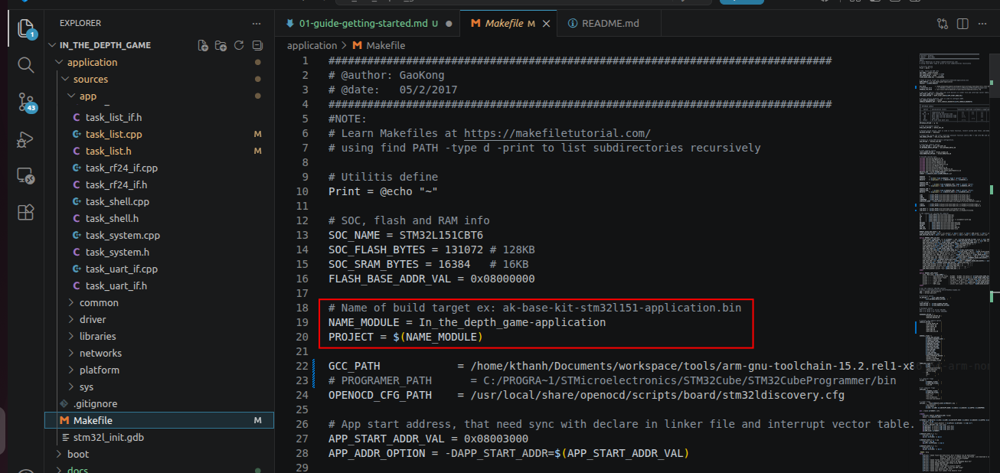
</p>

All game logic lives in the `application/sources/app` directory.

<p align="center">
  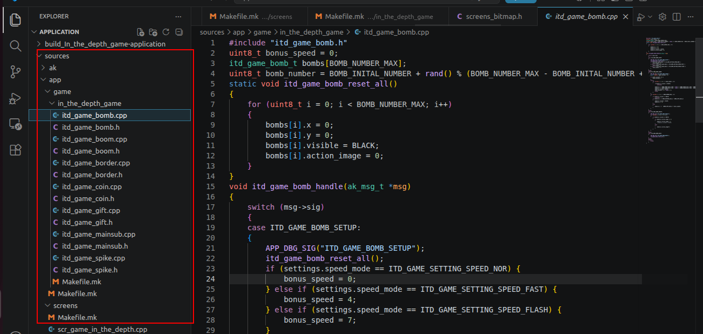
</p>

### Example: Displaying the welcome screen 

#### Step 1: Create or reuse header file `scr_welcome.h` and `scr_welcome.cpp` in the `screens/` directory to handle the bitmap data and render the welcome screen: 

<p align="center">
  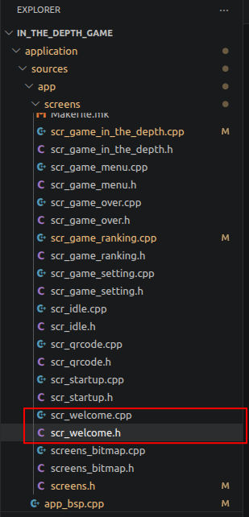
</p>

#### Step 2: Declare shared bitmap data of all objects which are displayed in welcome screen in `screen_bitmap.h` in `screens` directory and then write all object's bitmap data in `screen_bitmap.cpp`:
  - You can use web `https://javl.github.io/image2cpp/` to conver any images to bitmaps 
  - If you want to create your own model, animation... You can visit `https://www.pixilart.com`. 

<p align="center">
  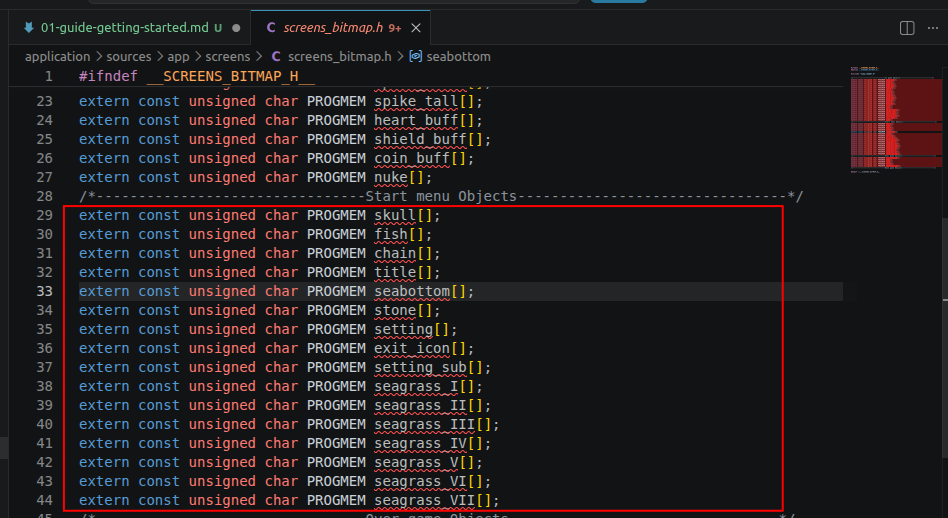
</p>

<p align="center">
  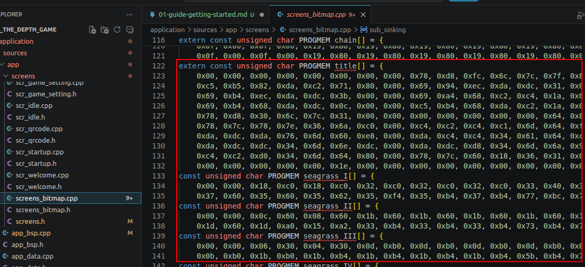
</p>

#### Step 3: Declare all handles and function in `screens.h`

<p align="center">
  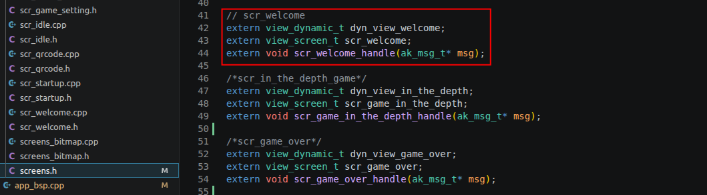
</p>

#### Step 4: Declare all objects size and remember to include `screens.h` in `scr_welcome.h`

<p align="center">
  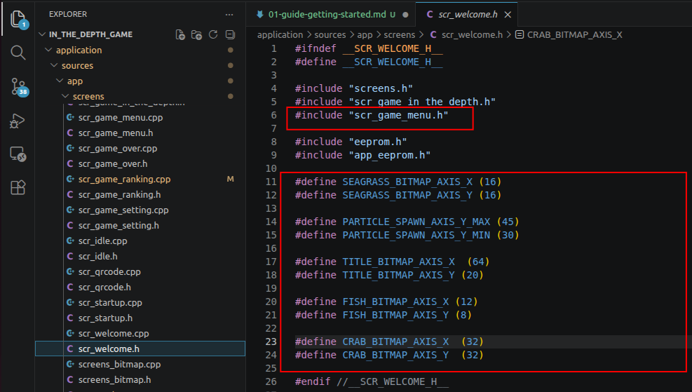
</p>

#### Step 5: Write all your code logic, object's position in `scr_welcome.cpp` and handle button callback which help `SCREEN_TRAN`

<p align="center">
  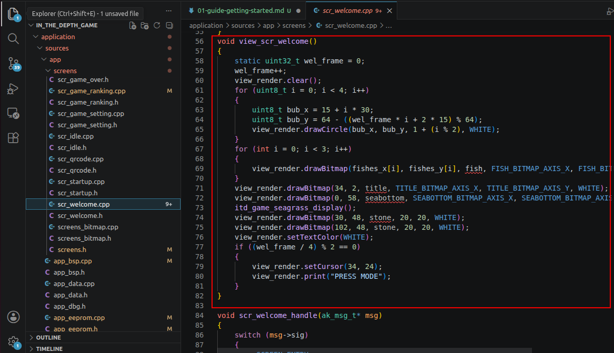
</p>

<p align="center">
  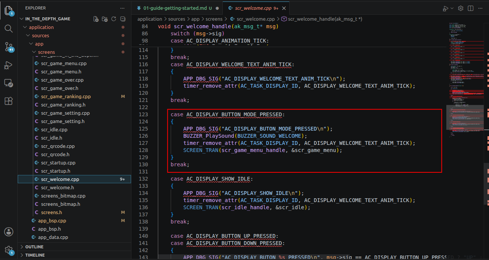
</p>

#### Step 6: Remember to mention `scr_welcom.cpp` in `Makefile` from `screens` directory

<p align="center">
  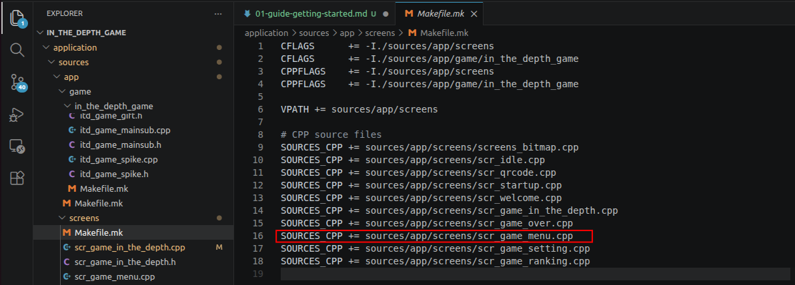
</p>

#### Step 7: After all previous step, when you compile, the LCD screen of AK should show something like this: 

<p align="center">
  
</p>

---

## References

- Blog: [AK Embedded Software](https://epcb.vn/blogs/ak-embedded-software)

---

## Contact & Support

<p style="font-size: 20px;"><strong>Nguyen Kim Thanh</strong> - Software Engineer - Embedded Systems</p>

``` Note
Thank you for visiting this repository.
If you have any questions, suggestions, or feedback about this project or firmware development, feel free to contact me directly.
```

<h3>Contact Me</h3>
<p>
  <a href="https://github.com/KimThanhNguyen1409">
    
  </a>
  
  <a href="https://www.linkedin.com/in/nguyenkimthanh1409/">
    
  </a>
  
  <a href="mailto:nkimthanh47@gmail.com">
    
  </a>
</p>

<p align="center">
  <i>Happy coding, and may you build some truly fun games!</i>
</p>
