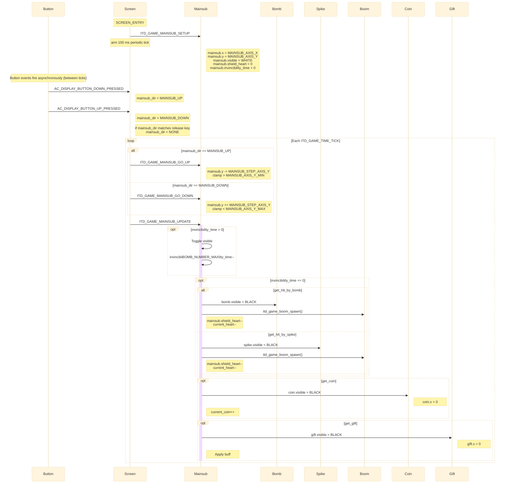
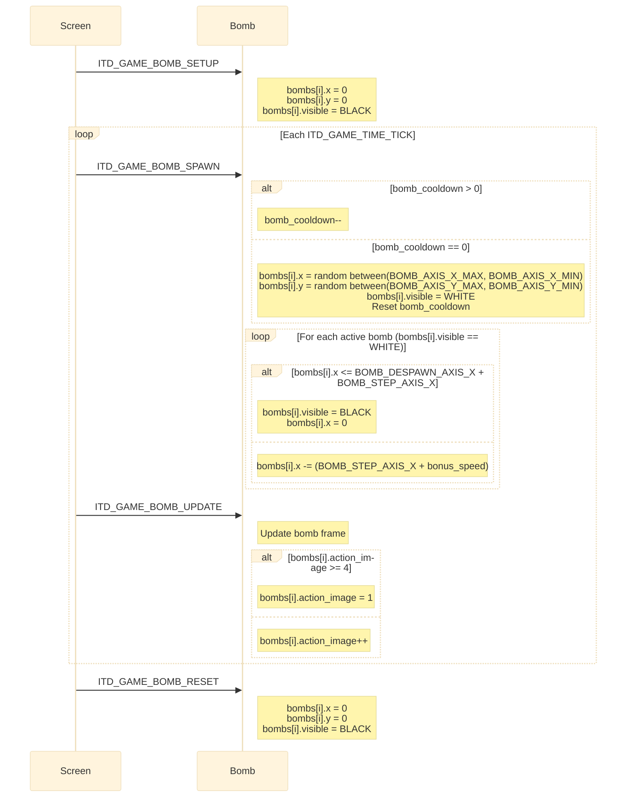
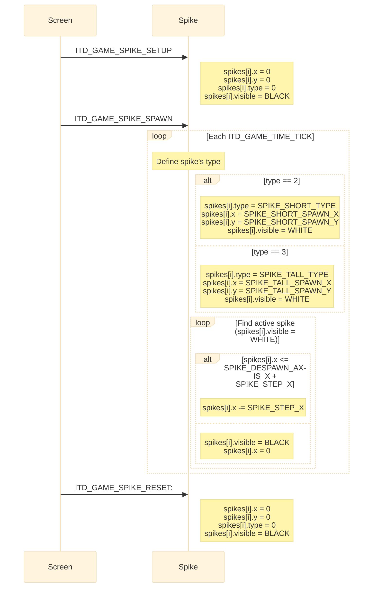
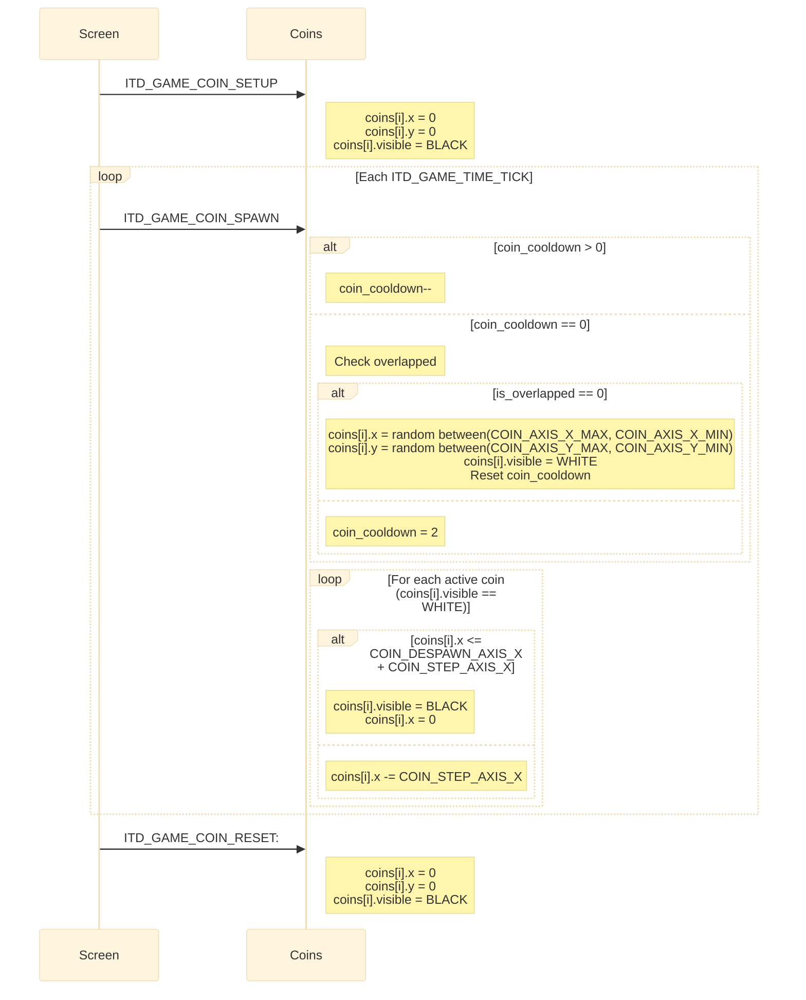
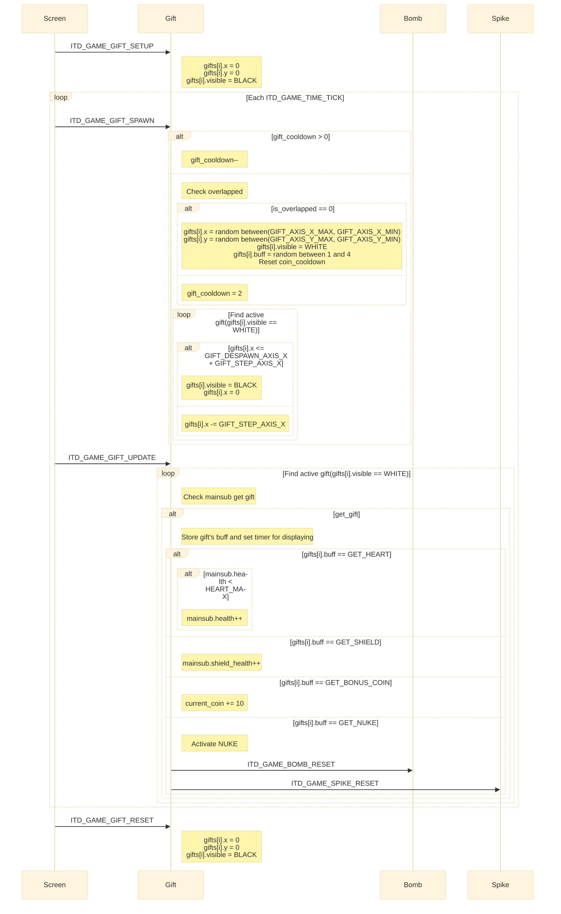
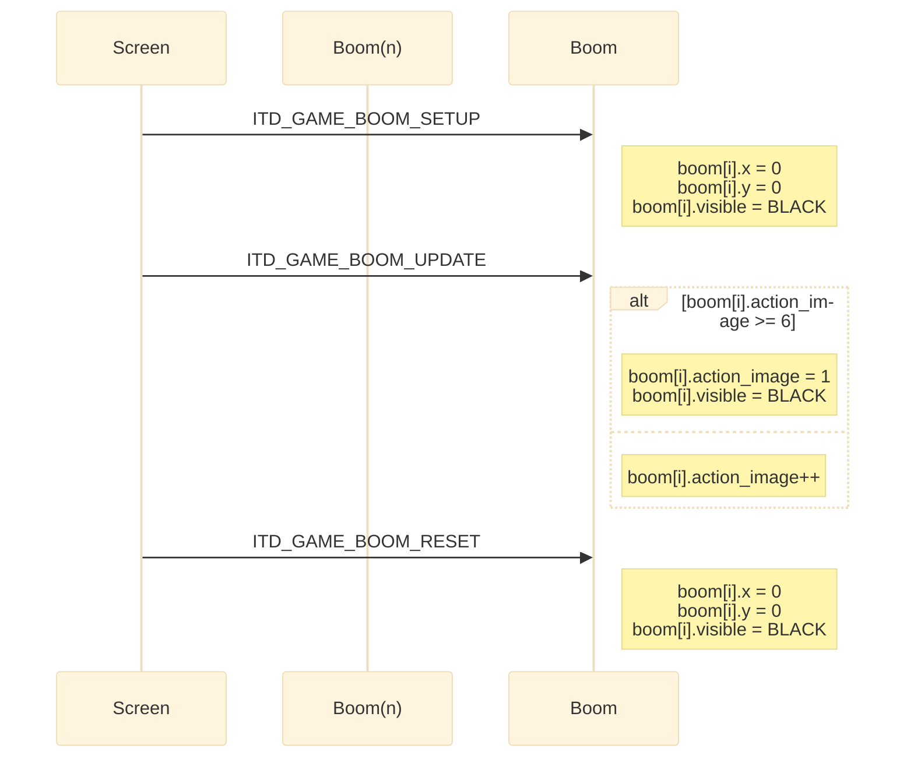
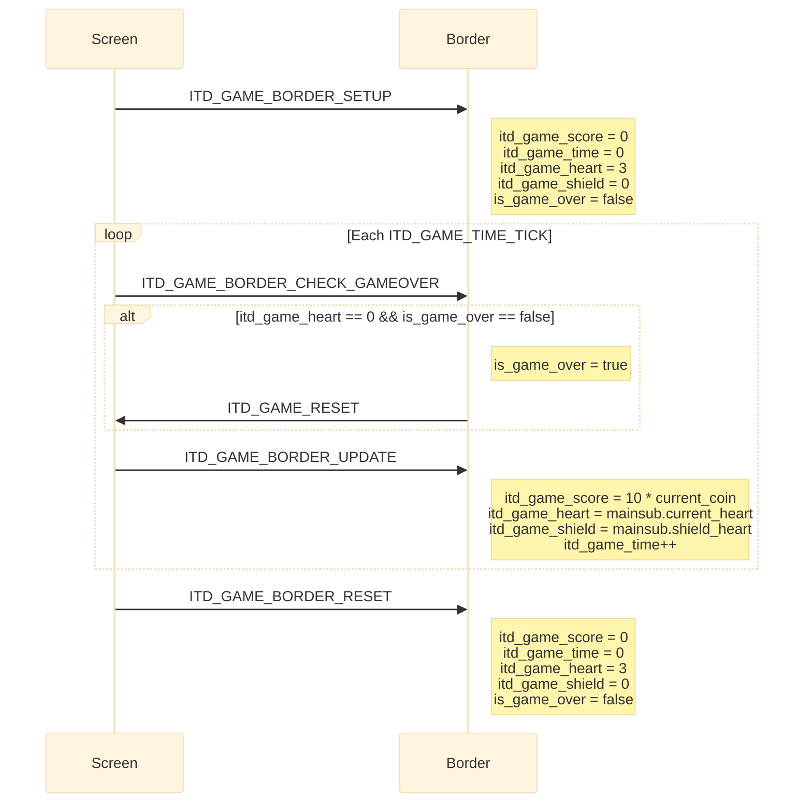

<h1 align="center">Game Object Sequences</h1>

This document describes the runtime sequence of each main object in "In the depth". Each object is handled by its own AK task and receives signals from the screen task (`scr_game_in_the_depth`), button callbacks, the periodic game tick timer, or other object tasks.

## I. Object Summary
|**Object**|**Task ID**|**Handler**|**Main responsibility**|
|----------|-----------|-----------|-----------------------|
|Mainsub | `ITD_GAME_MAINSUB_ID` |`itd_game_mainsub_handler()` |Controls the player's position and checks all collision statuses such as `check_hit_by_bomb` or `check_get_coin`. | 
|Bomb    | `ITD_GAME_BOMB_ID`| `itd_game_bomb_handler()` |Controls spawn rates, moves active bombs, and despawns them when they exit the screen. |
|Spike   | `ITD_GAME_SPIKE_ID`| `itd_game_spike_handler()`|Spawns spikes, assigns their types, moves them, and despawns them when they exit the screen. |
|Coin    | `ITD_GAME_COIN_ID`| `itd_game_coin_handler()`|Spawns coins randomly, moves them toward the player, and despawns them upon exit. |
|Gift    | `ITD_GAME_GIFT_ID`| `itd_game_gift_handler()`|Spawns gifts with random buffs and handles their movement. |
|Border  | `ITD_GAME_BORDER_ID`| `itd_game_border_handler()`|Tracks score, time, heart/shield stats, and checks game-over conditions. | 

The screen task posts `ITD_GAME_TIME_TICK` every `ITD_GAME_TIME_TICK_INTERVAL` (100ms). On each tick the screen task fans out signals to every object task in a fixed order.
## II. Mainsub Object Sequence  
Mainsub owns the player position (`Mainsub`). 
- **Setup:** `ITD_GAME_MAINSUB_SETUP` parks **Mainsub** at `(MAINSUB_AXIS_X, MAINSUB_AXIS_Y)` with `visible = WHITE` and initializes stats (`invincibility_time = 0`, `current_heart = HEART_MAX_NUMBER`, `shield_health = 0`).
- **Input:** Button callbacks update `mainsub_dir` within the Screen task without posting directly to Mainsub.
- **Per-tick:** On each `ITD_GAME_TIME_TICK`, the Screen task translates `mainsub_dir` into `ITD_GAME_MAINSUB_GO_DOWN` or `ITD_GAME_MAINSUB_GO_UP`, and posts `ITD_GAME_MAINSUB_UPDATE`.
    - `UP` / `DOWN` - Moves `mainsub.y` by `MAINSUB_STEP_AXIS_Y`, clamping it within screen bounds.
    - `UPDATE` - Checks all collisions (`bomb`, `spike`, `coin`, `gift`): 
        - **Bomb/Spike:** If not invincible, hitting an obstacle reduces `current_heart` or `shield_health`.
        - **Coin:** Collecting a coin increments the global coin count.
        - **Gift:** Collecting a gift immediately applies its buff effect to the player.
- **Reset:** `ITD_GAME_MAINSUB_RESET` resets the position and hides Mainsub (`visible = BLACK`).

<strong><em>Figure 1:</em></strong> Mainsub sequence logic

## III. Bomb Object Sequence
The Bomb task manages the `bombs[BOMB_NUMBER_MAX]` array. Spawn rates are randomly generated during active gameplay.
- **Setup:** `ITD_GAME_BOMB_SETUP` parks all bombs at `(0, 0)` and sets `visible = BLACK`.
- **Per-tick:** 
    - `ITD_GAME_BOMB_SPAWN`: Decrements `bomb_cooldown`. When it reaches 0, spawns a new bomb at a random position with `visible = WHITE`. It then iterates through all active bombs, moving them left by `BOMB_STEP_AXIS_X + bonus_speed`. If a bomb crosses the left border, it is despawned (`visible = BLACK`).
    - `ITD_GAME_BOMB_UPDATE`: Cycles the `action_image` for active bombs to animate them.
- **Reset:** `ITD_GAME_BOMB_RESET` hides and parks all bombs at `(0, 0)`.

<strong><em>Figure 2:</em></strong> Bomb sequence logic

## IV. Spike Object Sequence
The Spike task manages the `spikes[SPIKE_NUMBER]` array and their types.
- **Setup:** `ITD_GAME_SPIKE_SETUP` parks all spikes at `(0, 0)` with `type = 0` and `visible = BLACK`.
- **Per-tick:** `ITD_GAME_SPIKE_SPAWN` determines the spike type to spawn:
    - `type == 2`: Spawns a `SPIKE_SHORT_TYPE` at specific `(X, Y)` coordinates.
    - `type == 3`: Spawns a `SPIKE_TALL_TYPE` at specific `(X, Y)` coordinates.
    The new spike is set to `WHITE`. Active spikes are then moved left by `SPIKE_STEP_X`. If they cross the left border, they are despawned (`visible = BLACK`).
- **Reset:** `ITD_GAME_SPIKE_RESET` hides and parks all spikes at `(0, 0)`.

<strong><em>Figure 3:</em></strong> Spike sequence logic

## V. Coin Object Sequence
The Coin task manages the `coins[COIN_NUMBER_MAX]` array. 
- **Setup:** `ITD_GAME_COIN_SETUP` parks all coins at `(0, 0)` with `visible = BLACK`.
- **Per-tick:** `ITD_GAME_COIN_SPAWN` decrements `coin_cooldown`. If 0 and there are no overlapping objects, it spawns a new coin at a random location. It then moves all active coins left by `COIN_STEP_AXIS_X`, despawning them if they cross the left border.
- **Reset:** `ITD_GAME_COIN_RESET` hides and parks all coins at `(0, 0)`.

<strong><em>Figure 4:</em></strong> Coin sequence logic

## VI. Gift Object Sequence
The Gift task manages the `gifts[GIFT_NUMBER_MAX]` array.
- **Setup:** `ITD_GAME_GIFT_SETUP` parks all gifts at `(0, 0)` with `visible = BLACK`.
- **Per-tick:** 
    - `ITD_GAME_GIFT_SPAWN`: Decrements `gift_cooldown`. If 0 and space allows, spawns a new gift with a random buff ID (1 to 4). Active gifts are moved left and despawned if they cross the border.
    - `ITD_GAME_GIFT_UPDATE`: Processes logic when a gift is collected by the player (e.g., healing, adding shields, rewarding bonus coins, or activating the NUKE).
- **Reset:** `ITD_GAME_GIFT_RESET` hides and parks all gifts at `(0, 0)`.

<strong><em>Figure 5:</em></strong> Gift sequence logic

## VII. Boom Object Sequence

The Boom task handles the explosion animations when objects are destroyed.
- **Setup:** `ITD_GAME_BOOM_SETUP` parks all boom instances at `(0, 0)` with `visible = BLACK`.
- **Per-tick:** `ITD_GAME_BOOM_UPDATE` increments the `action_image` animation frame for all active explosions. Once the animation completes (`action_image >= 6`), the explosion is hidden.
- **Reset:** `ITD_GAME_BOOM_RESET` hides and parks all boom instances at `(0, 0)`.

<strong><em>Figure 6:</em></strong> Boom sequence logic

## VIII. Border Object Sequence

The Border task monitors the global game state, including player health, score, and game duration.
- **Setup:** `ITD_GAME_BORDER_SETUP` resets `score`, `time`, `heart` (to 3), `shield` (to 0), and sets `is_game_over = false`.
- **Per-tick:** 
    - `ITD_GAME_BORDER_CHECK_GAMEOVER`: Checks if player hearts have reached 0. Uses `is_game_over` as a latch to send a single `ITD_GAME_RESET` message to the Screen task.
    - `ITD_GAME_BORDER_UPDATE`: Synchronizes the border stats with current game variables (calculates score from coins, mirrors player hearts/shields, increments time).
- **Reset:** `ITD_GAME_BORDER_RESET` resets all tracked variables back to their initial states.

<strong><em>Figure 7:</em></strong> Border sequence logic

## IX. Per-Tick Signal Order
The screen task `scr_game_in_the_depth` posts the following sequences on every `ITD_GAME_TIME_TICK`:
1. `ITD_GAME_MAINSUB_GO_DOWN` or `ITD_GAME_MAINSUB_GO_UP` (depends on `mainsub_dir`)
2. `ITD_GAME_BOMB_SPAWN`
3. `ITD_GAME_BOMB_UPDATE`
4. `ITD_GAME_SPIKE_SPAWN`
5. `ITD_GAME_COIN_SPAWN`
6. `ITD_GAME_GIFT_SPAWN`
7. `ITD_GAME_GIFT_UPDATE`
8. `ITD_GAME_MAINSUB_UPDATE`
9. `ITD_GAME_BOOM_UPDATE`
10. `ITD_GAME_BORDER_CHECK_GAME_OVER`
11. `ITD_GAME_BORDER_UPDATE`

On `SCREEN_ENTRY` the screen task posts the matching `*_SETUP` signals to all object tasks and starts the periodic `ITD_GAME_TIME_TICK` timer.  
On `ITD_GAME_RESET` it removes the timer, posts the `*_RESET` signals, saves `scores.score_now` = `itd_game_score` and `time_last` = `itd_game_time`, transitions to `GAME_OVER`, plays `BUZZER_SOUND_GAME_OVER`, and arms a one-shot `ITD_GAME_EXIT_GAME` timer.
## X. Code References

|**Object**|**Source file**| **Header file**|
|---------|---------------|-----------------|
|Mainsub|`application/sources/app/game/in_the_depth_game/itd_game_mainsub.cpp`|`application/sources/app/game/in_the_depth_game/itd_game_mainsub.h`|
|Bomb|`application/sources/app/game/in_the_depth_game/itd_game_bomb.cpp`|`application/sources/app/game/in_the_depth_game/itd_game_bomb.h`|
|Spike|`application/sources/app/game/in_the_depth_game/itd_game_spike.cpp`|`application/sources/app/game/in_the_depth_game/itd_game_spike.h`|
|Coin|`application/sources/app/game/in_the_depth_game/itd_game_coin.cpp`|`application/sources/app/game/in_the_depth_game/itd_game_coin.h`|
|Gift|`application/sources/app/game/in_the_depth_game/itd_game_gift.cpp`|`application/sources/app/game/in_the_depth_game/itd_game_gift.h`|
|Boom|`application/sources/app/game/in_the_depth_game/itd_game_boom.cpp`|`application/sources/app/game/in_the_depth_game/itd_game_boom.h`|
|Border|`application/sources/app/game/in_the_depth_game/itd_game_border.cpp`|`application/sources/app/game/in_the_depth_game/itd_game_border.h`|
|Screen|`application/sources/app/screens/scr_game_in_the_depth.cpp`|`application/sources/app/screens/scr_game_in_the_depth.h`|