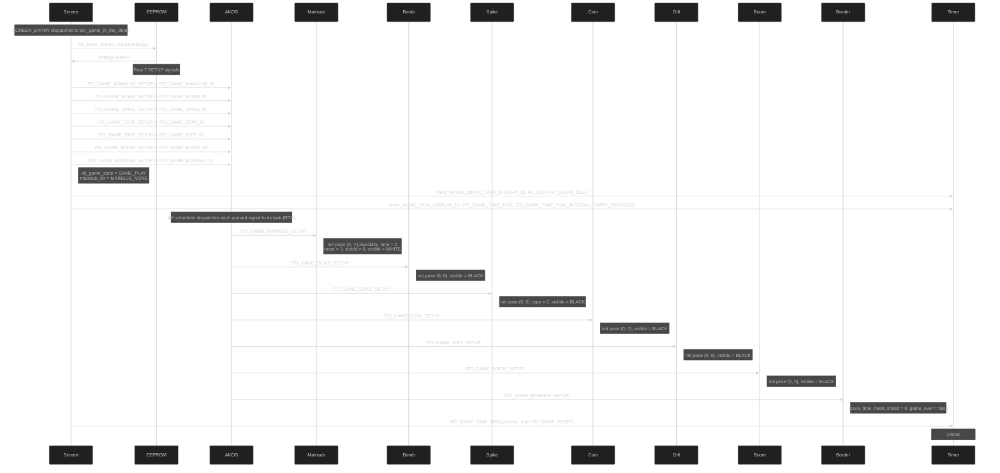
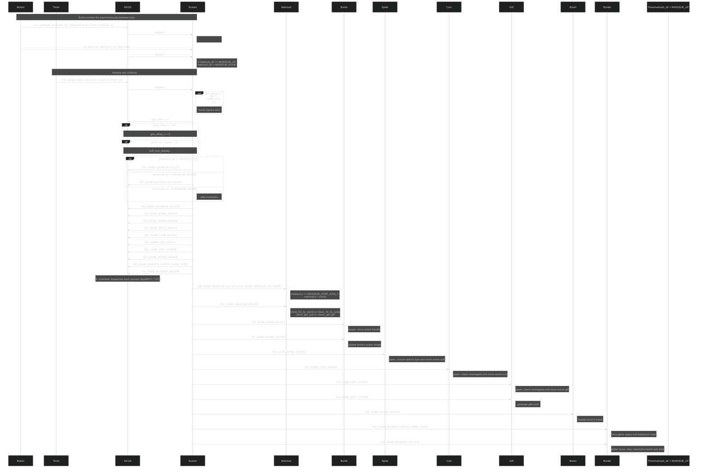
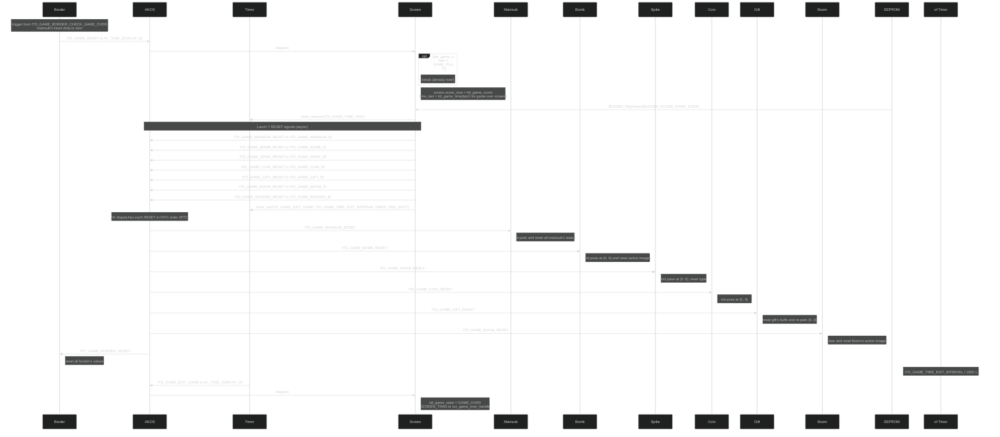

<h1 align="center">Runtime Signal Processing</h1>

This document explains how the In The Depth Game processes button input, task messages, game-loop ticks, and object updates. The game uses the AK event-driven task architecture: each major game object owns a task, receives signals through AK messages, and updates its own state.

## I. Overview

The In The Depth Game is implemented using event-driven tasks.

Each game object owns:

- A dedicated task
- Its own signal handler
- Its own state data
- Its own update logic

The display task (`AC_TASK_DISPLAY_ID`) owns the screen manager and handles screen-level events. During gameplay the active screen `scr_in_the_depth_game` receives the periodic game tick and posts update messages for each game-object task.

Input events from hardware buttons are converted into software signals. Button callbacks always post `AC_DISPLAY_BUTTON_*` signals to `AC_TASK_DISPLAY_ID`; the active screen handler decides what to do with them. During gameplay the screen translates UP/DOWN into a latched `mainsub_dir`.

The main game loop is driven by a periodic timer signal:

```c
ITD_GAME_TIME_TICK
```

The current game tick interval is:

```c
ITD_GAME_TIME_TICK_INTERVAL = 100 ms
```

Main runtime flow:

1. Button callbacks or timers create software signals.
2. Signals are posted into the AK message pool.
3. The AK scheduler dispatches messages to destination task handlers.
4. Each task updates only the state it owns.
5. The screen render reads the latest object state and refreshes the display buffer.

### High Level Architecture

#### 1. Game Start



<p align="center"><strong><em>Figure 1:</em></strong> Game start sequence logic</p>

#### 2. Game Playing



<p align="center"><strong><em>Figure 2:</em></strong> Gameplay sequence logic</p>

#### 3. Game Reset


<p align="center"><strong><em>Figure 3:</em></strong> Game reset sequence logic</p>

## II. Code References
|**Area**|**File**|
|-------|-------|
|Task IDs and task handlers |`application/sources/app/task_list.h`|
|Task table registration|`application/sources/app/task_list.cpp`|
|Signal definitions|`application/sources/app/app.h`|
|Button callback logic|`application/sources/app/app_bsp.cpp`|
|Main game screen logic|`application/sources/app/screens/scr_game_in_the_depth.cpp`|
|Game-over screen logic|`application/sources/app/screens/scr_game_over.cpp`|
|Screen manager|`application/sources/common/screen_manager.cpp`|

## III. Task Ownership
|**Task**|**Responsibility**|**Own Datas**|**Receives Data**|
|--------|-----------------|--------------|-----------------|
|`AC_TASK_DISPLAY_ID`|Screen manager, render scheduling, button routing, central game-tick dispatch|-|All `AC_DISPLAY_*` button signal, `ITD_GAME_SETUP`,`ITD_GAME_TICK`,`ITD_GAME_RESET`|
|`ITD_GAME_MAINSUB_ID`|Player control, check impact and collision|-|`ITD_GAME_MAINSUB_SETUP`,`ITD_GAME_MAINSUB_GO_UP`,`ITD_GAME_MAINSUB_GO_DOWN`,`ITD_GAME_MAINSUB_UPDATE`, `ITD_GAME_MAINSUB_RESET`|
|`ITD_GAME_BOMB_ID`|Bomb's movement and animation|-|`ITD_GAME_BOMB_SETUP`,`ITD_GAME_BOMB_SPAWN`,`ITD_GAME_BOMB_UPDATE`,`ITD_GAME_BOMB_RESET`|
|`ITD_GAME_SPIKE_ID`|Spike's type and movement|-|`ITD_GAME_SPIKE_SETUP`, `ITD_GAME_SPIKE_SPAWN`, `ITD_GAME_SPIKE_RESET`|
|`ITD_GAME_COIN_ID`|Coin's spawn rate and movement|-|`ITD_GAME_COIN_SETUP`,`ITD_GAME_COIN_SPAWN`,`ITD_GAME_COIN_RESET`|
|`ITD_GAME_GIFT_ID`|Gift's movement and generate buff|-|`ITD_GAME_GIFT_SETUP`, `ITD_GAME_GIFT_SPAWN`, `ITD_GAME_GIFT_UPDATE`,`ITD_GAME_GIFT_RESET`|
|`ITD_GAME_BOOM_ID`|Update Boom animation|-|`ITD_GAME_BOOM_SETUP`,`ITD_GAME_BOOM_UPDATE`,`ITD_GAME_BOOM_RESET`|
|`ITD_GAME_BORDER_ID`|Update score, time, heart, shield and check game over|-|`ITD_GAME_BORDER_SETUP`,`ITD_GAME_BORDER_UPDATE`,`ITD_GAME_BORDER_CHECK_GAME_OVER`,`ITD_GAME_BORDER_RESET`|
## IV. Button Event Processing
In "In The Depth", button callbacks always post `AC_DISPLAY_BUTTON_*` signals to `AC_TASK_DISPLAY_ID`. The currently active screen handler then decides what to do with them. The "In The Depth" gameplay screen (`scr_game_in_the_depth`) handles those signals locally; it does not require the BSP to know which screen is active. 
### Button Processing Rules

|**Button**|**BSP posts to AK**|**Active screen**|**Result inside the screen handler**|
|----------|-------------------|-----------------|------------------------------------|
|UP Pressed|`AC_DISPLAY_BUTTON_UP_PRESSED`->`AC_TASK_DISPLAY_ID`|`scr_game_in_the_depth`|`mainsub_dir = MAINSUB_UP`(no message posted)|
|UP Released|`AC_DISPLAY_BUTTON_UP_RELEASED`->`AC_TASK_DISPLAY_ID`|`scr_game_in_the_depth`|If`(mainsub_dir == MAINSUB_UP)`:<br>`mainsub_dir = MAINSUB_NONE`|
|DOWN Pressed|`AC_DISPLAY_BUTTON_DOWN_PRESSED`->`AC_TASK_DISPLAY_ID`|`scr_game_in_the_depth`|`mainsub_dir = MAINSUB_DOWN`(no message posted)|
|DOWN Released|`AC_DISPLAY_BUTTON_DOWN_RELEASED`->`AC_TASK_DISPLAY_ID`|`scr_game_in_the_depth`|If `(mainsub_dir == MAINSUB_DOWN)`:<br>`mainsub_dir = MAINSUB_NONE`|


